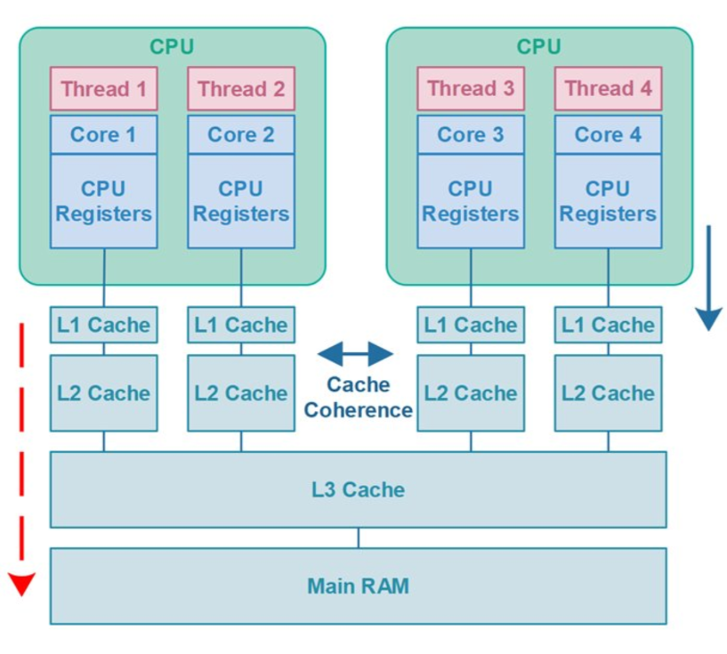
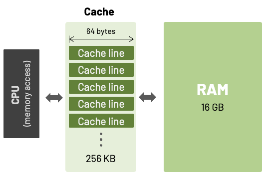
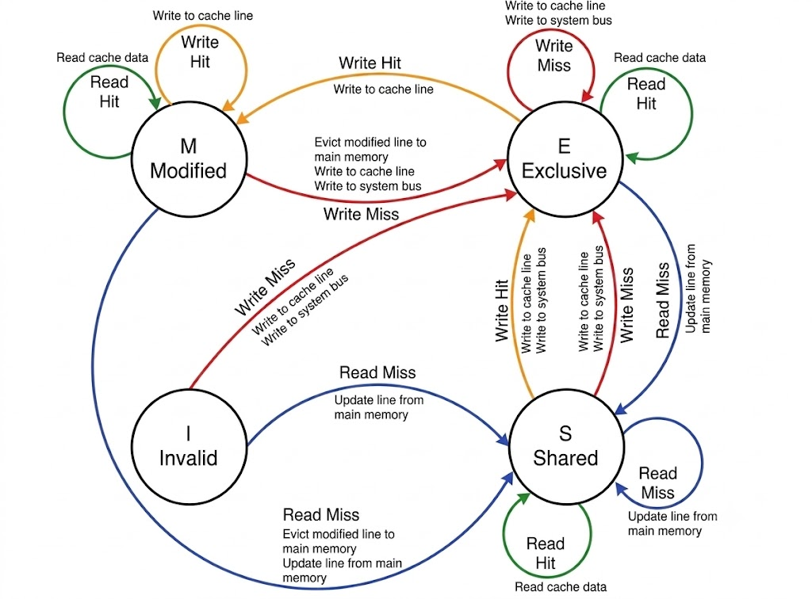
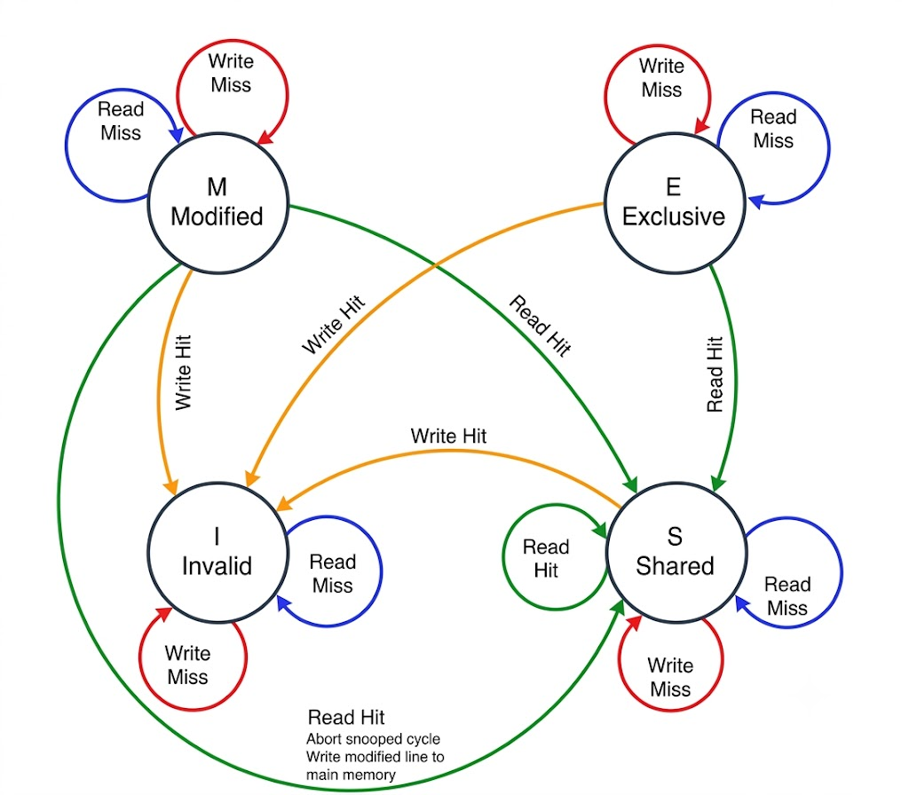

# Cache coherence 

In this document, I will explain the cache coherence and answer the question of others in the seminar 1 (10/Sep/2026)

Before going to the main part, everyone must know some definition that I list bellow: 

- **Cache**: Cache is the small memory that temporary store the copy data from main memory(RAM). Cache is faster than RAM.

- **Cache line**( Cache block): Each cache has many cache line, each cache line stored 64 byte data from RAM

- **Cache hit**: The requested data block exists in the
cache, so the system reads it instantly.
- **Cache miss**: The required data block is not in the
cache, forcing the system to read the block from slow
storage and load a copy into the cache

> The CPU always read data from cache, not from RAM. 

The situation when the cache only stored the data from RAM:

In the example bellow, we have 2 CPU need the data from X and add 2 time, the step to step 2 CPU core take the data from cache: 

|Time step|Event|Cache content for CPU A|Cache content for CPU B|Memory content of location X|
|-|-|-|-|-|
|0||||0|
|1|CPU A read X|0||0|
|2|CPU B read X|0|0|0|
|3|CPU A add 1 to X|1|0|1|
|4|CPU B add 1 to X|1|1|1|
|5|CPU A read X|1|1|1|
|6|CPU B read X|1|1|1|

So we can see, when the cache only store the data, the cache will no way to know when the main memory is updated. We can call this is Cache coherence problem.

> Now the idea that we need **write invalidate protocol**
to exclusive access to a data item. 

## MESI protocol

The MESI protocol will be implemented by idea above.

This protocol provide the state of each cache line: 

- **Invalid**: It is a non-valid state. The data you are looking for are not in the cache, or the local copyofthese data is not correct because another processor has updated the corresponding memory position.​

- **Shared**: Shared without having been modified. Another processor can have the data into thecachememory and both copies are in their current version.​

- **Exclusive**: Exclusive without having been modified. That is, this cache is the only one that hasthecorrect value of the block. Data blocks are according to the existing ones in the main memory​

- **Modified**: Actually, it is an exclusive-modified state. It means that the cache has the only copy that is correct in the whole system. The data which are in the main memory are wrong​

​The purpose of this protocol is helping the System have only 1 cache line can have the data from RAM when it change by its CPU core. Every other cores need read again from RAM to update the newest data. 

Now we solve the problem above by using MESI protocol: 

|Time step|Event|Cache content for CPU A|State of CPU A cache|Cache content for CPU B|State of CPU B Cache|Memory content of location X|
|-|-|-|-|-|-|-|
|0|||I||I|0|
|1|CPU A read X|0|S||I|0|
|2|CPU B read X|0|I|0|I|0|
|3|CPU A add 1 to X|0|E||I|0|
|4|CPU A add 1 to X|1|M||I|0|
|5|CPU B read X|1|S|1|S|1|
|6|CPU B add 1 to X||I|1|E|1|
|7|CPU B add 1 to X||I|2|M|1|
|8|CPU A read X|2|S|2|S|2|

> So we can see, the cache line always have the newest data from RAM when CPU read data.

Now we go to all situations when using MESI:

The state of each cache memory block can change depending on the actions taken by the CPU

The image above shows the transaction of each cache line when it directly receives an action from the CPU. This image does not show the actions of all cache lines when a transaction involving one cache line occurs. That means transactions caused indirectly by the CPU bus, such as a cache line changing from any state to the Invalid state due to BUS snooping action(*), are not presented here.

- When the CPU core performs any hit action (read hit, write hit), it interacts directly with the cache line that stores the required data.

- When the CPU core performs any miss action (write miss, read miss), it chooses a cache line based on the LRU (Least Recently Used)(**) algorithm and does not care about the state of that cache line.

For example:

- When the cache is empty and a block of memory is written into the cache by the processor, this block has the Exclusive state because there are no other copies of that block in the cache. Then, if this block is written to, it changes to the Modified state because the block exists only in one cache, but it has been modified, so the data in the cache is different from the data in main memory.

- When the CPU needs a modified cache line for a miss action, this cache line will push its data to RAM before reading other data from RAM and changing its state to Shared.

- When the CPU performs a write hit on a cache line, this cache line will change to the Exclusive state first. After that, when the CPU updates the data inside this cache line, its state will change to the Modified state.

Now, after showing all the transactions of a cache line when it directly receives an action request from the CPU, I will show the cache line transactions when it receives an action through snooping from other cache lines on the cache bus:

In this image, miss means that the data being requested is not stored in the listened cache line, while hit means that the data is the same as the data stored in the listened cache line.

- So, when the cache line knows that the data is not the same as its own data(receive miss), it keeps its current state.

- When receiving a read hit, it means that another core is preparing to read the same data as the listened cache line. Therefore, the cache line needs to update its state to Shared and push the data to RAM if it is still in the Modified state.

- When receiving a write hit, it means that another core is preparing to write new data to the data stored in the listened cache line. Therefore, the state returns to Invalid, and the cache line needs to get the data from RAM when it is used again.

(*) Bus snooping is the situation when cache line know the message that other cache line comunicate in the bus line. For example, when modified cache line know another cache line need the data which stored inside its self, it will push the data from cache line to RAM and change to Shared state. The cache controller of each core will receive the action of other cores controller

(**) LRU is the algorithm that the CPU core will take the longest active cache line to serve the the `miss` action.